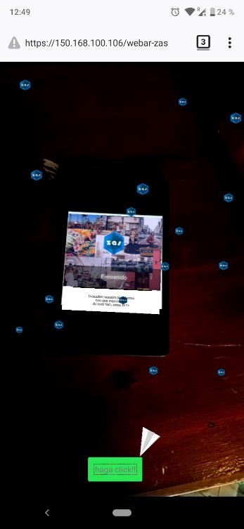
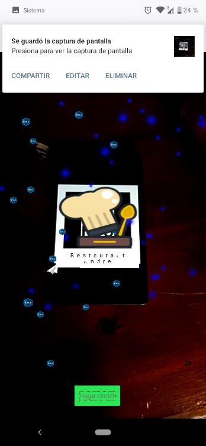
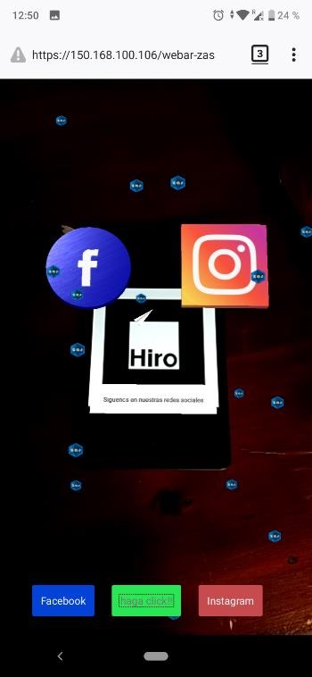

# webarzas

 

# Características
  - Detección de marcador HIRO
  - Se implementa la librería AFRAME SPE PARTICLES para la creación de partículas con animaciones
  (https://github.com/harlyq/aframe-spe-particles-component)  
  - Se implementa la librería AFRAME PRAMETRIC PATH FOLLOW Y PARSER para la animación de movimientos con ecuaciones paramétricas  
  - Se implementa la librería AFRAME PARTICLEPLAYER COMPONENT para la animación de particulas efecto fuegos artificiales
  - Librerías en: https://stemkoski.github.io/A-Frame-Examples/
  - Implementación de deep linking (abrir apps de android con js)
# Requisitos

  - Aframe Inspector (https://github.com/aframevr/aframe-inspector) 
  - Simulador de servidor (Xampp o Wampp)

# Como empezar
  - Iniciar Aframe Inspector
  - Copiar y pegar este proyecto en htdocs ya sea de Xampp o Wampp
  - Acceder desde el navegador con la ruta correspondiente
